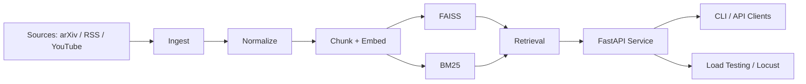

# multimodal-rag-ingest

Production-style multimodal retrieval-augmented generation (RAG) system that ingests arXiv papers, YouTube talks, and RSS posts into a unified knowledge base supporting dense, lexical, and hybrid retrieval, grounded citation-backed answers, FastAPI serving, and load/performance analysis.

## Overview

This project builds a production-style multimodal retrieval system that ingests papers, blogs, and videos into a unified index and serves hybrid search via a FastAPI API. It focuses on retrieval quality (Recall@K, MRR), system robustness (failed-chunk isolation), and serving performance under load (Locust-based testing and latency analysis).

**Key result:** Built a hybrid retrieval system over 73K+ chunks with measurable retrieval quality (MRR 0.2167) and characterized serving bottlenecks under load (~40 RPS saturation).

## Features

### Ingestion
- arXiv ingestion via API + PDF parsing
- YouTube ingestion via `yt-dlp` captions, with Whisper fallback transcription when captions are unavailable and `OPENAI_API_KEY` is set
- RSS ingestion via feed parsing + article extraction
- Deterministic `doc_id` generation from source URI hash
- Idempotent ingestion with duplicate protection in source JSONL files

### Retrieval
- OpenAI embeddings for dense retrieval
- FAISS dense vector index
- BM25 lexical index
- Hybrid retrieval (FAISS + BM25) using Reciprocal Rank Fusion (RRF)
- Automatic dense-only fallback when BM25 artifacts are missing
- Grounded answers generated strictly from retrieved context with validated citations

### Evaluation
- Multi-mode retrieval evaluation for `dense`, `bm25`, and `hybrid`
- Retrieval evaluation metrics: `Recall@1`, `Recall@5`, `Recall@10`, and `MRR`
- Evaluation scored over unique document IDs to avoid duplicate chunk hits distorting results

## System Capabilities

- Multimodal ingestion: arXiv PDFs, RSS/blog content, and YouTube transcripts
- Production-style indexing pipeline with FAISS dense vectors and BM25 lexical search
- Hybrid retrieval using Reciprocal Rank Fusion (RRF)
- Grounded answer generation with validated citations
- Retrieval benchmarking using Recall@K and Mean Reciprocal Rank (MRR)
- FastAPI serving with typed request/response models and request timing logs
- Locust-based load testing for latency/throughput characterization and bottleneck analysis
- Resilient indexing with failed-chunk isolation during embedding generation

## Architecture



## Benchmarks and Performance

Current corpus scale:
- `1,230` documents
- `73,581` indexed chunks


Retrieval benchmark results on the current corpus:

| mode   | Recall@1 | Recall@5 | Recall@10 | MRR  |
|--------|----------|----------|-----------|------|
| dense  | 0.1250   | 0.2250   | 0.2500    | 0.1988 |
| bm25   | 0.1250   | 0.2000   | 0.2000    | 0.1975 |
| hybrid | 0.1250   | 0.1750   | 0.2250    | 0.2167 |

Metric definitions:
- `Recall@1`, `Recall@5`, `Recall@10`: fraction of relevant document IDs retrieved within the top-k results
- `MRR`: mean reciprocal rank of the first relevant retrieved document

Serving and load-test summary:
- Locust was used to characterize the `/retrieve` endpoint under increasing concurrency rather than to present a peak-throughput success story.
- In testing, hybrid retrieval throughput plateaued around `~40 RPS`, while latency increased sharply at higher concurrency.
- The primary value of this benchmark is system observability: it helps identify latency/throughput tradeoffs and where the serving stack starts to saturate.

Note: hybrid retrieval shows higher MRR but slightly lower Recall@5 compared to dense-only in this dataset, likely due to score fusion sensitivity and small evaluation set size.

### Observed bottlenecks:
- Latency increases sharply beyond ~40 RPS due to synchronous request handling and lack of batching in the retrieval pipeline
- FAISS + BM25 retrieval runs on CPU without parallel query optimization
- FastAPI single-node deployment without request batching or async embedding

### Potential improvements:
- async batching for embedding + retrieval
- FAISS GPU or IVF/HNSW tuning
- caching frequent queries
- horizontal scaling (multiple workers / replicas)


## Pipeline Overview

- `ingest`: collect raw arXiv, RSS/blog, and YouTube sources into source-specific JSONL files
- `normalize`: standardize raw records into a unified `docs.jsonl` schema
- `index`: chunk documents, compute embeddings, build the FAISS index, and build BM25 artifacts
- `query`: retrieve relevant chunks and generate a grounded answer with citations
- `eval`: benchmark retrieval quality by mode and write a structured report to `data/eval/results.json`


## Quick Start

Prerequisites:
- Python 3.11+
- `uv` (recommended) or `pip`
- `ffmpeg` on `PATH` (required for YouTube audio extraction/transcription fallback)
- OpenAI API key for embedding/indexing and LLM answering

Setup:

```bash
make setup
cp .env.example .env
# set OPENAI_API_KEY=...
```

End-to-end pipeline:

```bash
python -m src.cli ingest arxiv --query "retrieval augmented generation" --max 5
python -m src.cli ingest rss --feeds sources/rss_feeds.txt
python -m src.cli ingest youtube --urls sources/youtube_urls.txt
python -m src.cli normalize
python -m src.cli index
python -m src.cli query --q "What is retrieval augmented generation?" --k 5
python -m src.cli eval --file eval/questions.json --k 5
```

Primary artifacts:
- `data/processed/docs.jsonl`
- `data/processed/chunks.jsonl`
- `data/index/faiss.index`
- `data/index/metadata.jsonl`
- `data/index/bm25.joblib`

## CLI Commands

### Ingest
```bash
python -m src.cli ingest arxiv --query "retrieval augmented generation" --max 10
python -m src.cli ingest rss --feeds sources/rss_feeds.txt
python -m src.cli ingest youtube --urls sources/youtube_urls.txt
```

### Process and Index

```bash
python -m src.cli normalize
python -m src.cli index
```

### Query and Evaluate
```bash
python -m src.cli query --q "What is RAG?" --k 5
python -m src.cli eval --file eval/questions.json --k 5
```

### Serve API
```bash
make api
```

## Example Queries

- CLI retrieval:
  ```bash
  python -m src.cli query --q "What is retrieval augmented generation?" --k 5
  ```
  Expect retrieved chunks and a citation-backed answer grounded in the indexed corpus.

- CLI retrieval on retrieval system design:
  ```bash
  python -m src.cli query --q "How do vector databases help in RAG systems?" --k 5
  ```
  Expect a mix of dense retrieval matches and supporting citations from papers, blogs, or transcripts discussing indexing and retrieval.

- API retrieval:
  ```bash
  curl -X POST http://localhost:8000/retrieve \
    -H "Content-Type: application/json" \
    -d '{"query":"What is reciprocal rank fusion?","k":5,"mode":"hybrid"}'
  ```
  Expect ranked hits with `doc_id`, citation, retrieval mode, and text snippets suitable for debugging search quality.

- API retrieval for lexical vs semantic overlap:
  ```bash
  curl -X POST http://localhost:8000/retrieve \
    -H "Content-Type: application/json" \
    -d '{"query":"How does BM25 differ from dense retrieval?","k":5,"mode":"bm25"}'
  ```
  Expect lexical matches that surface exact-term overlap, useful for comparing BM25 against dense or hybrid retrieval.

- API grounded answer:
  ```bash
  curl -X POST http://localhost:8000/answer \
    -H "Content-Type: application/json" \
    -d '{"query":"What is retrieval augmented generation?","k":5,"mode":"dense"}'
  ```
  Expect a grounded response plus citation metadata derived from the retrieved context.

## API Testing

### Health Check

Use the health endpoint to confirm the service is running:

```bash
curl http://localhost:8000/health
```

Expected response example:

```json
{"status":"ok"}
```

### Test Retrieval Endpoint

Dense retrieval example:

```bash
curl -X POST http://localhost:8000/retrieve \
  -H "Content-Type: application/json" \
  -d '{
    "query": "What is retrieval augmented generation?",
    "k": 5,
    "mode": "dense"
  }'
```

This returns ranked retrieval results including document IDs, citations, scores, and text snippets.

Hybrid retrieval example:

```bash
curl -X POST http://localhost:8000/retrieve \
  -H "Content-Type: application/json" \
  -d '{
    "query": "What is retrieval augmented generation?",
    "k": 5,
    "mode": "hybrid"
  }'
```

### Test Answer Endpoint

```bash
curl -X POST http://localhost:8000/answer \
  -H "Content-Type: application/json" \
  -d '{
    "query": "What is retrieval augmented generation?",
    "k": 5,
    "mode": "dense"
  }'
```

This returns a grounded answer generated from the retrieved context, along with citations and retrieval metadata.

### Test Input Validation

```bash
curl -X POST http://localhost:8000/retrieve \
  -H "Content-Type: application/json" \
  -d '{
    "query": "test",
    "mode": "invalid_mode"
  }'
```

The API should return a validation error, typically HTTP `422`.

### Verify Required Artifacts

The API requires local index artifacts:

```bash
ls data/index/faiss.index
ls data/index/bm25.joblib
ls data/index/metadata.jsonl
```

If artifacts are missing, rebuild them:

```bash
python -m src.cli normalize
python -m src.cli index
```

### Test via Docker

```bash
docker build -t multimodal-rag-api .
docker run --rm -p 8000:8000 --env-file .env multimodal-rag-api
```

Then verify:

```bash
curl http://localhost:8000/health
```

### Optional: FastAPI Docs

Interactive API docs are available at:

```text
http://localhost:8000/docs
```

## Evaluation

Run:

```bash
python -m src.cli eval --file eval/questions.json --k 5
```

Outputs:
- mode-by-mode table for `dense`, `bm25`, and `hybrid` (when BM25 index exists)
- `Recall@1`, `Recall@5`, `Recall@10`, `MRR`
- detailed JSON report at `data/eval/results.json`
- evaluation over unique document IDs so repeated chunk hits from the same document do not inflate metrics

Retrieval modes:
- `dense`: FAISS vector search over OpenAI embeddings
- `bm25`: lexical search over the BM25 index
- `hybrid`: Reciprocal Rank Fusion (RRF) over dense and BM25 rankings

BM25-enabled evaluation runs automatically when `data/index/bm25.joblib` exists. If that artifact is missing, `eval` falls back to `dense` mode only.


## Project Summary

- Built a multimodal retrieval pipeline ingesting arXiv papers, RSS/blog posts, and YouTube transcripts into a unified corpus of `1,230` documents and `73,581` indexed chunks.
- Implemented dense (FAISS), BM25, and hybrid retrieval using Reciprocal Rank Fusion (RRF), with retrieval benchmarking across `Recall@1/5/10` and `MRR`.
- Added a FastAPI retrieval service, Docker packaging, Locust-based load testing, and resilient indexing with failed-chunk isolation for production-style observability.

## API Service

Run locally:

```bash
make api
```

The FastAPI app starts on `http://127.0.0.1:8000` and loads retrieval resources at startup when local artifacts are available.

Endpoints:
- `GET /health`: service health plus FAISS/BM25/embedder readiness
- `POST /retrieve`: retrieve top-k results for `dense`, `bm25`, or `hybrid`
- `POST /answer`: run retrieval plus grounded answer generation

Example request:

```bash
curl -X POST http://127.0.0.1:8000/retrieve \
  -H "Content-Type: application/json" \
  -d '{"query":"What is retrieval augmented generation?","k":5,"mode":"hybrid"}'
```

Run in Docker:

```bash
docker build -t multimodal-rag-ingest .
docker run --rm -p 8000:8000 --env-file .env multimodal-rag-ingest
```

## Latency Benchmarking

Use the lightweight benchmark script against the retrieval endpoint:

```bash
make bench_api

# or directly
python scripts/benchmark_api.py \
  --url http://127.0.0.1:8000/retrieve \
  --query "What is retrieval augmented generation?" \
  --mode hybrid \
  --requests 25 \
  --concurrency 4
```

The benchmark reports:
- average latency
- p50 latency
- p95 latency
- max latency
- approximate throughput in requests per second

## Load Testing

Run Locust against the retrieval endpoint:

```bash
locust -f tests/load_test_locust.py --host=http://localhost:8000
```

Or via Make:

```bash
make load-test
```

Open the Locust UI:

```text
http://localhost:8089
```

Recommended starting configuration:
- number of users: `50-200`
- spawn rate: `5-20`

Record:
- requests per second (QPS)
- p50 latency
- p95 latency

## Testing

1. Unit tests
```bash
make test
```

2. Smoke test
```bash
make smoke
```

3. Full paid smoke test
```bash
make smoke_paid
```

Smoke behavior notes:
- `make smoke` always runs normalization and validates `data/processed/docs.jsonl`.
- By default, `make smoke` attempts query (`SMOKE_QUERY=1`) only if `data/index/faiss.index` already exists.
- Query execution can call OpenAI (embedding for retrieval and chat completion for answers), so smoke may call OpenAI depending on flags and existing artifacts.
- If index is missing, `make smoke` skips query to avoid costs.
- `make smoke_paid` forces indexing + query and will incur OpenAI usage.

## Data Schemas

### `docs.jsonl`

```json
{
  "doc_id": "string",
  "source_type": "arxiv_pdf|youtube|rss_blog",
  "title": "string",
  "source_uri": "string",
  "created_at": "ISO8601",
  "segments": [
    {
      "segment_id": "string",
      "text": "string",
      "metadata": {
        "page": 3,
        "timestamp_start": 12.34,
        "timestamp_end": 18.21,
        "url": "string",
        "published_at": "ISO8601"
      }
    }
  ]
}
```

### `chunks.jsonl`

```json
{
  "chunk_id": "string",
  "doc_id": "string",
  "text": "string",
  "metadata": {
    "source_type": "arxiv_pdf|youtube|rss_blog",
    "title": "string",
    "source_uri": "string",
    "citation": "[arxiv:<doc_id> p.<page>] | [youtube:<doc_id> HH:MM:SS] | [rss:<doc_id>]"
  }
}
```

### `eval/questions.json`

```json
[
  {
    "question": "What is retrieval augmented generation?",
    "relevant_doc_ids": ["abc123def4567890"]
  }
]
```

## Repository Layout

```text
multimodal-rag-ingest/
├── src/
│   ├── api/
│   ├── cli.py
│   ├── ingest/
│   ├── index/
│   ├── rag/
│   └── eval/
├── data/
│   ├── raw/
│   ├── processed/
│   └── index/
├── sources/
│   ├── rss_feeds.txt
│   └── youtube_urls.txt
├── eval/
│   └── questions.json
├── scripts/
│   ├── benchmark_api.py
│   └── smoke_test.py
├── tests/
├── Dockerfile
├── Makefile
└── README.md
```

## Roadmap

- Cross-encoder reranking
- Incremental indexing
- Faithfulness scoring
- Web UI

## Why this project

This project demonstrates an end-to-end production-style retrieval system design, focusing on data ingestion, indexing, retrieval quality, and serving performance under realistic workloads. It emphasizes:
- multimodal ingestion and normalization over papers, blogs, and video transcripts
- dense, lexical, and hybrid retrieval with explicit benchmark reporting
- API serving, containerization, and load-test instrumentation
- operational rigor through request timing, structured outputs, and failed-chunk isolation during indexing

## License

MIT
