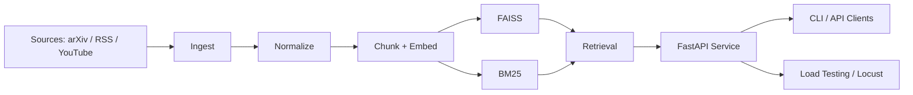

# Multi-Source RAG Platform

A production-style multi-source RAG platform that ingests arXiv PDFs, RSS/blog content, and YouTube transcripts into a unified text corpus, supporting dense, sparse, and hybrid retrieval, retrieval evaluation, grounded answer generation, FastAPI serving, and performance testing.

## Key Results

- Unified corpus of `1,230` documents and `73,581` indexed chunks
- Hybrid retrieval MRR of `0.2167`
- Hybrid retrieval throughput saturation around `~40 RPS` under load
- Persistent embedding cache reduced indexing time from `~25m 36s` cold to `~31s` warm—a `~98%` reduction

## Architecture


```mermaid
flowchart LR
    A[Sources: arXiv / RSS / YouTube] --> B[Ingest]
    B --> C[Normalize]
    C --> D[Chunk + Embed]
    D --> E[FAISS]
    D --> F[BM25]
    E --> G[Retrieval]
    F --> G[Retrieval]
    G --> H[FastAPI Service]
    H --> I[CLI / API Clients]
    H --> J[Load Testing / Locust]
```

## Features

### Ingestion

- Multi-source ingestion for arXiv PDFs, RSS/blog content, and YouTube transcripts
- arXiv ingestion via API and PDF parsing
- RSS ingestion via feed parsing and article extraction
- YouTube ingestion via `yt-dlp` captions, with Whisper fallback transcription when captions are unavailable and `OPENAI_API_KEY` is set
- Deterministic `doc_id` generation from source URI hashes
- Idempotent ingestion with duplicate protection in source JSONL files

### Retrieval

- OpenAI embeddings with a FAISS dense vector index
- Sparse lexical search with BM25
- Hybrid FAISS + BM25 retrieval using Reciprocal Rank Fusion (RRF)
- Automatic dense-only fallback when BM25 artifacts are missing
- Answers generated strictly from retrieved context with validated citations

### Evaluation and Reliability

- Multi-mode evaluation for `dense`, `bm25`, and `hybrid` using `Recall@1`, `Recall@5`, `Recall@10`, and `MRR`
- Evaluation over unique document IDs so duplicate chunk hits do not distort results
- Failed-chunk isolation during embedding generation
- Persistent embedding caching to avoid re-embedding unchanged chunks
- FastAPI serving with typed request/response models and request timing logs
- Docker packaging and Locust-based latency, throughput, and bottleneck analysis

## Benchmarks and Performance

Retrieval benchmark results on the current corpus:

| mode   | Recall@1 | Recall@5 | Recall@10 | MRR  |
|--------|----------|----------|-----------|------|
| dense  | 0.1250   | 0.2250   | 0.2500    | 0.1988 |
| bm25   | 0.1250   | 0.2000   | 0.2000    | 0.1975 |
| hybrid | 0.1250   | 0.1750   | 0.2250    | 0.2167 |

Metric definitions:

- `Recall@1`, `Recall@5`, `Recall@10`: fraction of relevant document IDs retrieved within the top-k results
- `MRR`: mean reciprocal rank of the first relevant retrieved document

Serving and load-test summary:

- Locust was used to characterize the `/retrieve` endpoint under increasing concurrency rather than to present a peak-throughput success story.
- In testing, hybrid retrieval throughput plateaued around `~40 RPS`, while latency increased sharply at higher concurrency.
- The primary value of this benchmark is system observability: it helps identify latency/throughput tradeoffs and where the serving stack starts to saturate.

Note: hybrid retrieval shows higher MRR but slightly lower Recall@5 compared to dense-only in this dataset, likely due to score fusion sensitivity and small evaluation set size.

### Indexing Efficiency

With persistent embedding caching enabled, repeated indexing avoids re-embedding unchanged chunks.

- Corpus size: ~73K chunks across 1.2K documents
- Cold indexing time: ~25m 36s
- Warm indexing time: ~31s
- Cache hit rate: 100%

This results in a ~98% reduction in indexing time and eliminates redundant embedding API calls.

### Observed Bottlenecks

- Latency increases sharply beyond ~40 RPS due to synchronous request handling and lack of batching in the retrieval pipeline
- FAISS + BM25 retrieval runs on CPU without parallel query optimization
- FastAPI single-node deployment without request batching or async embedding

### Potential Improvements

- async batching for embedding + retrieval
- FAISS GPU or IVF/HNSW tuning
- caching frequent queries
- horizontal scaling (multiple workers / replicas)

## Quick Start

Prerequisites:

- Python 3.11+
- `uv` (recommended) or `pip`
- `ffmpeg` on `PATH` (required for YouTube audio extraction/transcription fallback)
- OpenAI API key for embedding/indexing and LLM answering

Setup:

```bash
make setup
cp .env.example .env
# set OPENAI_API_KEY=...
```

End-to-end pipeline:

```bash
python -m src.cli ingest arxiv --query "retrieval augmented generation" --max 5
python -m src.cli ingest rss --feeds sources/rss_feeds.txt
python -m src.cli ingest youtube --urls sources/youtube_urls.txt
python -m src.cli normalize
python -m src.cli index
python -m src.cli query --q "What is retrieval augmented generation?" --k 5
python -m src.cli eval --file eval/questions.json --k 5
```

Primary artifacts:

- `data/processed/docs.jsonl`
- `data/processed/chunks.jsonl`
- `data/index/faiss.index`
- `data/index/metadata.jsonl`
- `data/index/bm25.joblib`

## CLI Commands

### Ingest
```bash
python -m src.cli ingest arxiv --query "retrieval augmented generation" --max 10
python -m src.cli ingest rss --feeds sources/rss_feeds.txt
python -m src.cli ingest youtube --urls sources/youtube_urls.txt
```

### Process and Index

```bash
python -m src.cli normalize
python -m src.cli index
```

### Query and Evaluate
```bash
python -m src.cli query --q "What is RAG?" --k 5
python -m src.cli eval --file eval/questions.json --k 5
```

### Serve API
```bash
make api
```

### Example Queries

```bash
python -m src.cli query --q "What is retrieval augmented generation?" --k 5
python -m src.cli query --q "How do vector databases help in RAG systems?" --k 5
```

```bash
curl -X POST http://localhost:8000/retrieve \
  -H "Content-Type: application/json" \
  -d '{"query":"What is reciprocal rank fusion?","k":5,"mode":"hybrid"}'
```

```bash
curl -X POST http://localhost:8000/retrieve \
  -H "Content-Type: application/json" \
  -d '{"query":"How does BM25 differ from dense retrieval?","k":5,"mode":"bm25"}'
```

```bash
curl -X POST http://localhost:8000/answer \
  -H "Content-Type: application/json" \
  -d '{"query":"What is retrieval augmented generation?","k":5,"mode":"dense"}'
```

## API Service

Run locally:

```bash
make api
```

The FastAPI app starts on `http://127.0.0.1:8000` and loads retrieval resources at startup when local artifacts are available.

Endpoints:

- `GET /health`: service health plus FAISS/BM25/embedder readiness
- `POST /retrieve`: return ranked `dense`, `bm25`, or `hybrid` results with document IDs, citations, scores, and text snippets
- `POST /answer`: return a grounded answer with citations and retrieval metadata

Example request:

```bash
curl -X POST http://127.0.0.1:8000/retrieve \
  -H "Content-Type: application/json" \
  -d '{"query":"What is retrieval augmented generation?","k":5,"mode":"hybrid"}'
```

### Health Check

Use the health endpoint to confirm the service is running:

```bash
curl http://localhost:8000/health
```

Expected response example:

```json
{"status":"ok"}
```

### Test Retrieval Endpoint

Dense retrieval example:

```bash
curl -X POST http://localhost:8000/retrieve \
  -H "Content-Type: application/json" \
  -d '{
    "query": "What is retrieval augmented generation?",
    "k": 5,
    "mode": "dense"
  }'
```

This returns ranked retrieval results including document IDs, citations, scores, and text snippets.

Hybrid retrieval example:

```bash
curl -X POST http://localhost:8000/retrieve \
  -H "Content-Type: application/json" \
  -d '{
    "query": "What is retrieval augmented generation?",
    "k": 5,
    "mode": "hybrid"
  }'
```

### Test Answer Endpoint

```bash
curl -X POST http://localhost:8000/answer \
  -H "Content-Type: application/json" \
  -d '{
    "query": "What is retrieval augmented generation?",
    "k": 5,
    "mode": "dense"
  }'
```

This returns a grounded answer generated from the retrieved context, along with citations and retrieval metadata.

### Test Input Validation

```bash
curl -X POST http://localhost:8000/retrieve \
  -H "Content-Type: application/json" \
  -d '{
    "query": "test",
    "mode": "invalid_mode"
  }'
```

The API should return a validation error, typically HTTP `422`.

### Verify Required Artifacts

The API requires local index artifacts:

```bash
ls data/index/faiss.index
ls data/index/bm25.joblib
ls data/index/metadata.jsonl
```

If artifacts are missing, rebuild them:

```bash
python -m src.cli normalize
python -m src.cli index
```

### Docker

```bash
docker build -t multi-source-rag-platform .
docker run --rm -p 8000:8000 --env-file .env multi-source-rag-platform
```

Then verify:

```bash
curl http://localhost:8000/health
```

### Optional: FastAPI Docs

Interactive API docs are available at:

```text
http://localhost:8000/docs
```

## Evaluation

Run:

```bash
python -m src.cli eval --file eval/questions.json --k 5
```

Outputs:

- mode-by-mode table for `dense`, `bm25`, and `hybrid` (when BM25 index exists)
- `Recall@1`, `Recall@5`, `Recall@10`, `MRR`
- detailed JSON report at `data/eval/results.json`
- evaluation over unique document IDs so repeated chunk hits from the same document do not inflate metrics

Retrieval modes:

- `dense`: FAISS vector search over OpenAI embeddings
- `bm25`: lexical search over the BM25 index
- `hybrid`: Reciprocal Rank Fusion (RRF) over dense and BM25 rankings

BM25-enabled evaluation runs automatically when `data/index/bm25.joblib` exists. If that artifact is missing, `eval` falls back to `dense` mode only.

## Load Testing and Benchmarking

### Latency Benchmarking

Use the lightweight benchmark script against the retrieval endpoint:

```bash
make bench_api

# or directly
python scripts/benchmark_api.py \
  --url http://127.0.0.1:8000/retrieve \
  --query "What is retrieval augmented generation?" \
  --mode hybrid \
  --requests 25 \
  --concurrency 4
```

The benchmark reports:

- average latency
- p50 latency
- p95 latency
- max latency
- approximate throughput in requests per second

### Load Testing

Run Locust against the retrieval endpoint:

```bash
locust -f tests/load_test_locust.py --host=http://localhost:8000
```

Or via Make:

```bash
make load-test
```

Open the Locust UI:

```text
http://localhost:8089
```

Recommended starting configuration:

- number of users: `50-200`
- spawn rate: `5-20`

Record:

- requests per second (QPS)
- p50 latency
- p95 latency

## Testing

### Unit Tests

```bash
make test
```

### Smoke Test

```bash
make smoke
```

### Full Paid Smoke Test

```bash
make smoke_paid
```

Smoke behavior notes:

- `make smoke` always runs normalization and validates `data/processed/docs.jsonl`.
- By default, `make smoke` attempts query (`SMOKE_QUERY=1`) only if `data/index/faiss.index` already exists.
- Query execution can call OpenAI (embedding for retrieval and chat completion for answers), so smoke may call OpenAI depending on flags and existing artifacts.
- If index is missing, `make smoke` skips query to avoid costs.
- `make smoke_paid` forces indexing + query and will incur OpenAI usage.

## Data Schemas

### `docs.jsonl`

```json
{
  "doc_id": "string",
  "source_type": "arxiv_pdf|youtube|rss_blog",
  "title": "string",
  "source_uri": "string",
  "created_at": "ISO8601",
  "segments": [
    {
      "segment_id": "string",
      "text": "string",
      "metadata": {
        "page": 3,
        "timestamp_start": 12.34,
        "timestamp_end": 18.21,
        "url": "string",
        "published_at": "ISO8601"
      }
    }
  ]
}
```

### `chunks.jsonl`

```json
{
  "chunk_id": "string",
  "doc_id": "string",
  "text": "string",
  "metadata": {
    "source_type": "arxiv_pdf|youtube|rss_blog",
    "title": "string",
    "source_uri": "string",
    "citation": "[arxiv:<doc_id> p.<page>] | [youtube:<doc_id> HH:MM:SS] | [rss:<doc_id>]"
  }
}
```

### `eval/questions.json`

```json
[
  {
    "question": "What is retrieval augmented generation?",
    "relevant_doc_ids": ["abc123def4567890"]
  }
]
```

## Repository Layout

```text
multi-source-rag-platform/
├── src/
│   ├── api/
│   ├── cli.py
│   ├── ingest/
│   ├── index/
│   ├── rag/
│   └── eval/
├── data/
│   ├── raw/
│   ├── processed/
│   └── index/
├── sources/
│   ├── rss_feeds.txt
│   └── youtube_urls.txt
├── eval/
│   └── questions.json
├── scripts/
│   ├── benchmark_api.py
│   └── smoke_test.py
├── tests/
├── Dockerfile
├── Makefile
└── README.md
```

## Roadmap

- Cross-encoder reranking
- Incremental indexing
- Faithfulness scoring
- Web UI

## License

MIT
